# Creative Corner - Find Your People

The objective of this project is to bring budding artists in the stillorgan, Dublin area under one place to show art or take workshops. The site is an MVP version built using HTML5 & CSS3 for the Milestone 1 project for Code Institute's Full Stack Development diploma.

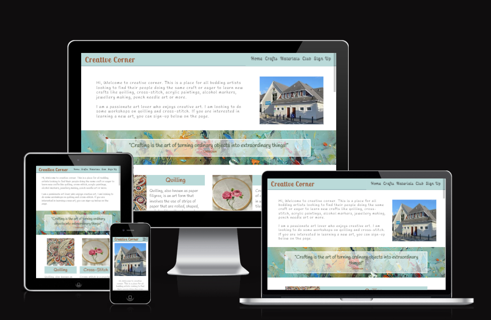

Live Link: https://hennasingh.github.io/creative-corner/

## User Experience - UX

### Strategy

This project got inspired by the existing [Kilmacud Crokes clubs](https://kilmacudcrokes.com/) based in Stillorgan. The House as part of the club has activities that members can participate in. Unfortunately, there wasn't a place for them to look at timings of the class or see the activities in action or engage with members who are already attending, or volunteer to conduct art workshops and hence Creative Corner is born.

- User Stories
    - First time Visitor Goals
        - I should be able to understand the purpose of the website and to learn more about the business.
        - The content can be easily navigated without back and forth
        - I can look at testimonials from others, access social media links and check authenticity
    - Returning Visitor Goals
        - I want to know how to contact the business for more information to participate
        - I want to look at new activities and events happening and able to register for it.

    
Creative Corner - Design Brief

   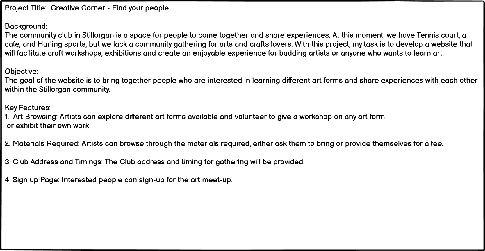

### Scope

As a passionate artist myself, I decided to add 4 sections to the website to gauge user awareness and interest:

- Home Page: Introduction about myself and types of arts I can teach. Call to Action for signing up for workshops
- Crafts: A brief overview of different types of arts people can come together and learn.
- Materials: Description of materials that are required to learn the specific art form.
- Club Address: The address of the club where other activities and workshops will take place.
- Signup Form: To allow users to register for art workshops.

### Skeleton

The wireframes for mobile and desktop were created using [Balsamiq](https://balsamiq.com/)

Desktop Wireframe

Mobile Wireframe

The wireframes here were the initial idea of the website. Some design elements were changed for mobile to improve visibility and 
readability of the content.

## User Interface - Design

### Typography

Fonts have been imported from [GoogleFonts](https://fonts.google.com/)

- The Lobster Two and Dancing Script were suggestions from chatGPT for an artistic website. Unfortunately, the dancing script was not readable on smaller screen sizes and on recommendation from Mentor, the font for body was changed to 'Handlee' keeping the handwriting style intact.

### Colors

Color Scheme idea was taken from [Coolers](cooler.co) on uploading the quote image to the platform. 

    
Color Palette

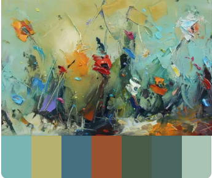

## Site Features

### Navigation Bar

The navigation bar contains links to different sections(Home, Crafts, Materials, Club, Signup) of the website to assist user to navigate through the page easily.

    
Desktop Navbar

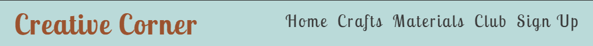

    
Responsive Navbar

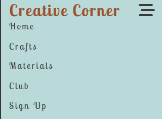

### Home Section

This section gives introduction about the website's purpose and call to action to signUp.

Desktop View for Home Section

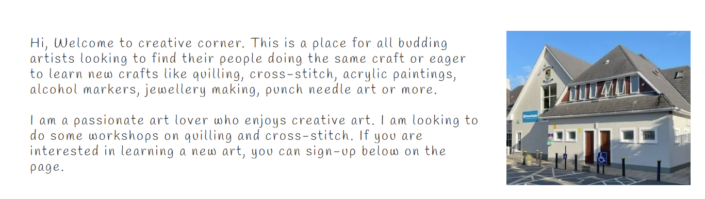

Responsive View for Home Section

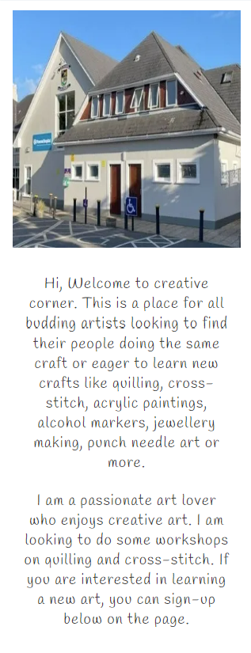

### Crafts Section

This section details the different crafts available that user can register workshop for

Desktop View for Crafts Section

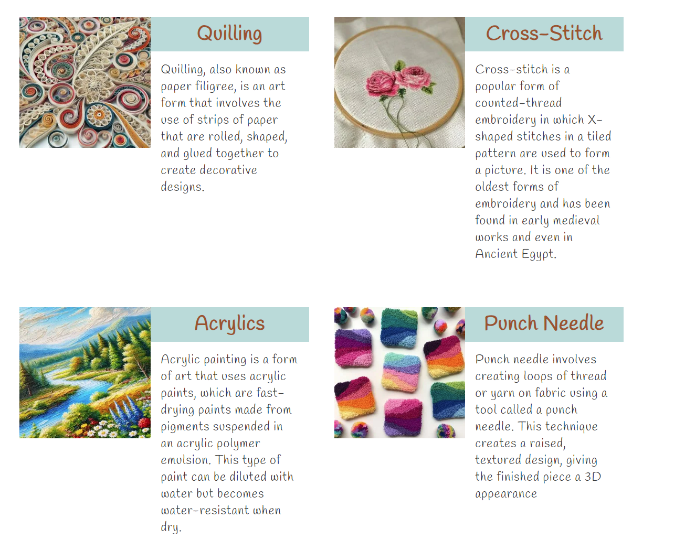

Responsive View of Crafts Section

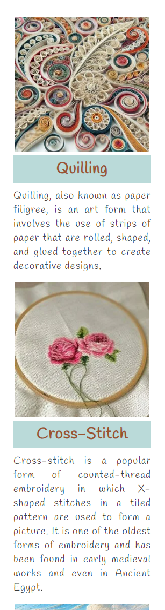

### Materials Section

This section describes materials needed for each craft. The details can be viewed by hovering over the image on desktop and clicking on the image on mobile.

Desktop View for Material Section

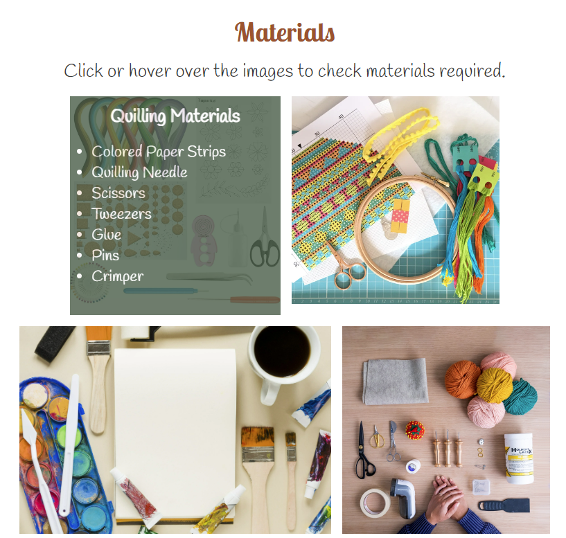

Mobile View for Material Section

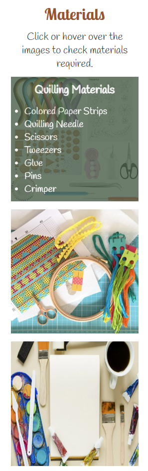

### Club Section

This section provides details on the clubhouse, different activities available and its address

Desktop View of the Clubhouse Section

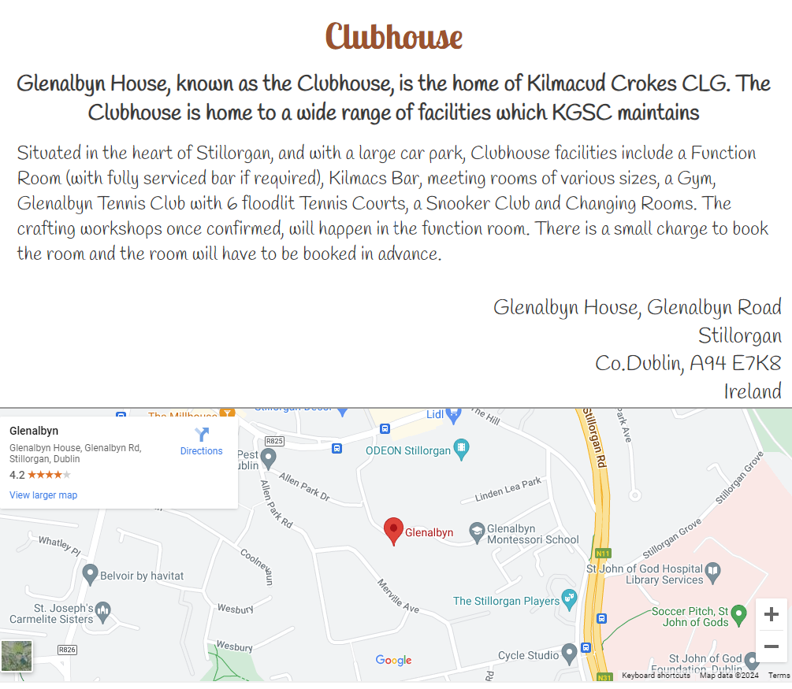

Responsive View for Clubhouse Section

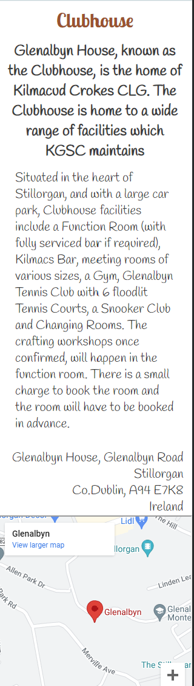

### Signup Form

The users can signup for workshops or exhibitions to be held in the function room. The users will be identified by email.

Signup Form - Desktop View

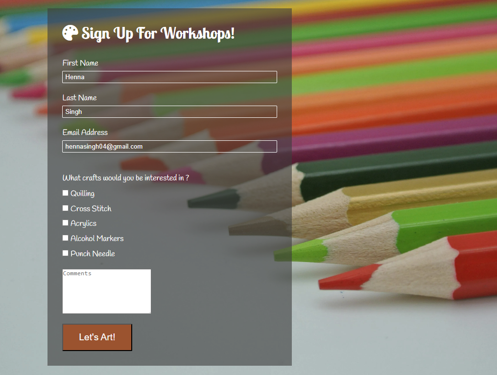

Responsive View for Signup Form

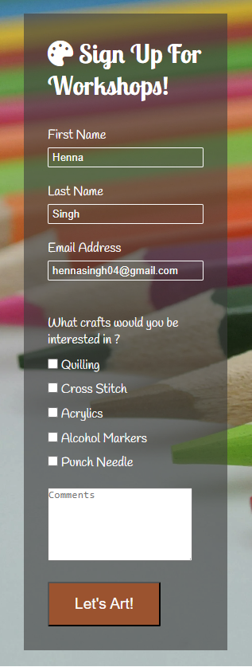

### Form Dump

Form Dump on submitting the form

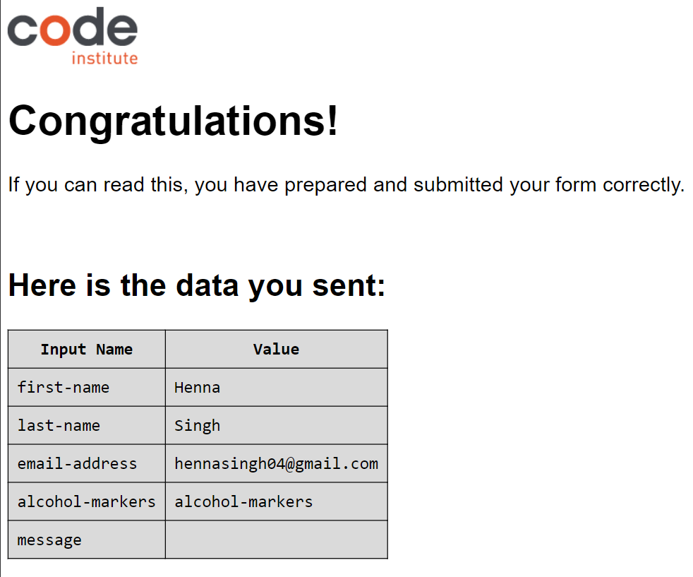

### Footer

The footer section contains the social media links for the website. At this moment, the link redirect to the media home page.

Footer on Desktop

Responsive footer on mobile

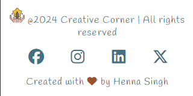

## Future Implementations

1. The lighthouse reports result in low best practices score. The next version of the site will focus on improving the score highlighted 
by the tests.

2. The next version of the website will include testimonials from users doing the workshops and exhibitions. Some real life photographs will be added to the website.

3. The next version of the website will display date, time and type of the workshop being held.

4. The website will also feature different local artists and an opportunity to buy their art.

## Technologies Used

### Languages

- HTML
- CSS

### Other Sites and Softwares

- [Balsamiq](https://balsamiq.com/) - For designing wireframes for desktop and mobile, and for writing design brief.

- [Font Awesome](https://fontawesome.com/icons) - For icons for social media (facebook, instagram, X, and linkedIn)

- [Icons8](https://icons8.com/icons/set/creativity) - For creativity favicon

- Git/Github - For version control and save project for website

- [chatGPT](https://chat.openai.com/) - For content on crafts, font suggestions and images for crafts (quilling, acrylics, alcohol markers)

- [Image Resizer](https://imageresizer.com/) - For cropping and resigning images.

- [cwebp](https://www.npmjs.com/package/cwebp) - For converting images from jpg/png to webp formats

## Testing

The testing details for the website can be found in [testing.md](testing.md)

## Deployment & Gitpod Development

### Github Pages

The website is deployed using Github Pages functionality provided by Github. The steps to follow are:

1. Create a Github account if you dont already have one
2. The repository for Creative Corner was created using a template provided by Code Institute. This can be found on the repository title [here](https://github.com/hennasingh/creative-corner).
3. Go to settings tab on the menu bar of the repository.
4. In the left section, under Code and automation, click on Pages.
5. Under the title "Build and deployment", select the source: Deploy from a branch.
6. Under the branch section below that, select /root folder and save.
7. Come back to Code section of the repository. Give a few minutes and refresh the page. You will find Deployments section generated the right side with a URL to the deployed site.

### Gitpod Development

The project Creative Corner was developed using Gitpod that provides the functionality to work in VS code within the browser. The steps I followed setting up account and develop the project:

1. Create a Github repository using a template if you have one.
2. Install [Gitpod extension](https://chromewebstore.google.com/detail/gitpod/dodmmooeoklaejobgleioelladacbeki?hl=en&pli=1) in the browser you use.
3. Create a Gitpod account. With Code Institute, there was provision of enterprise gmail account provided by them. I used that email to sign-up for Gitpod account. You can use your personal email to sign-up. It provides limited hours to work on Gitpod. There are other ways to increase the hours.
4. Once in the Gitpod account, create a workspace, by pasting the link of the repository created in step 1. Other option is once you create repository in Github, the repository can be opened in Gitpod using the open button. Read more [here](https://www.gitpod.io/docs/configure/user-settings/browser-extension)
5. Once, the workspace is created, you can run this command on terminal to preview your repo `python3 -m http.server`. 
6. You can continue to make changes in the workspace within Gitpod and commit your changes to Github and also see preview of your website.

## Credits

 - [extraordinary chaos](https://extraordinarychaos.com/amazing-quotes-about-crafting.html) - For crafting quote.

 - [W3Schools](https://www.w3schools.com/howto/howto_css_image_overlay.asp) - For image overlay fade used in Materials section.

 - [Code-Institute](https://www.codeinstitute.net) For amazing guidance on CSS and HTML via Love Running project

 - [Google Fonts](https://fonts.google.com/) - For fonts used in the website ('Lobster Two', 'Handlee')

- [Coolers](https://coolors.co/) - For color theme.

- [Pexels](www.pexels.com), [Freepick](www.freepick.com), [iStock](www.istockphoto.com), [unsplash]()- For images used in the website.

- [UI.dev](https://ui.dev/amiresponsive) - To show the site on different screen sizes.

## Acknowledgments

 - [Kilmacrud Crokes](https://kilmacudcrokes.com/house) - For inspiration and content about the Clubhouse

 - Spencer Barriball - Mentor : For guidance and review on the website

 - Kamil Wojciechowski - Cohort Facilitator : For weekly stand-up meetings and informative sessions

 - Class April 2024 - For motivation, idea brainstorming and group discussions.

