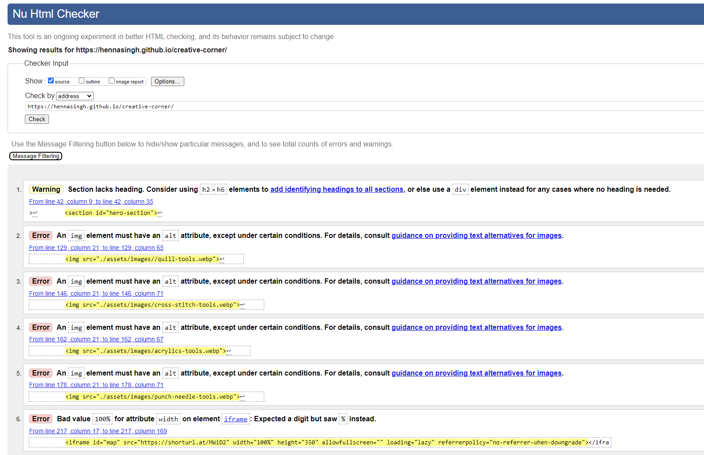
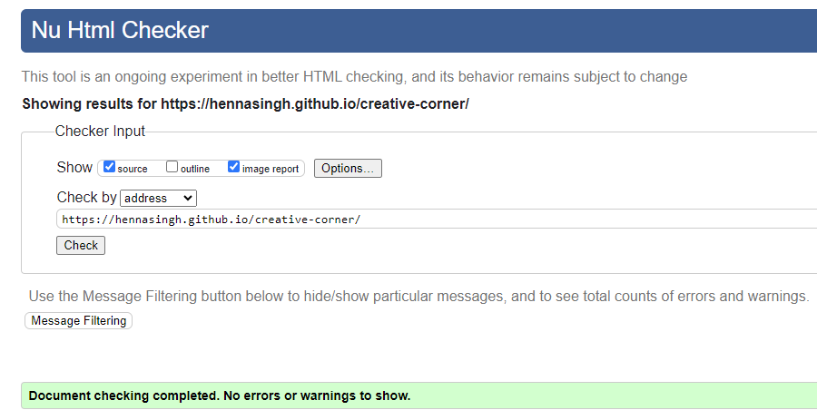
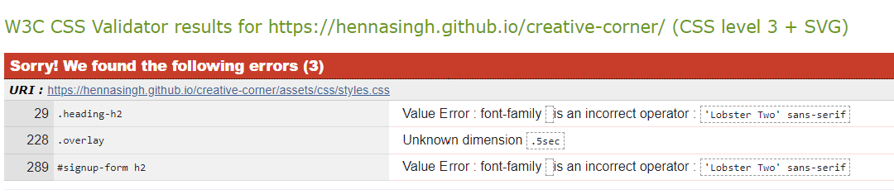
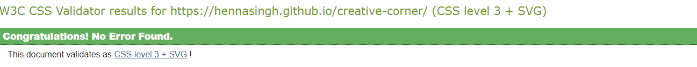
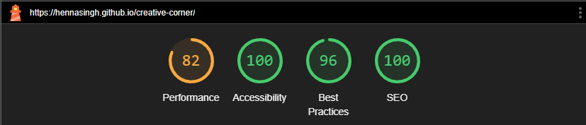
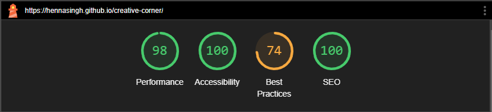
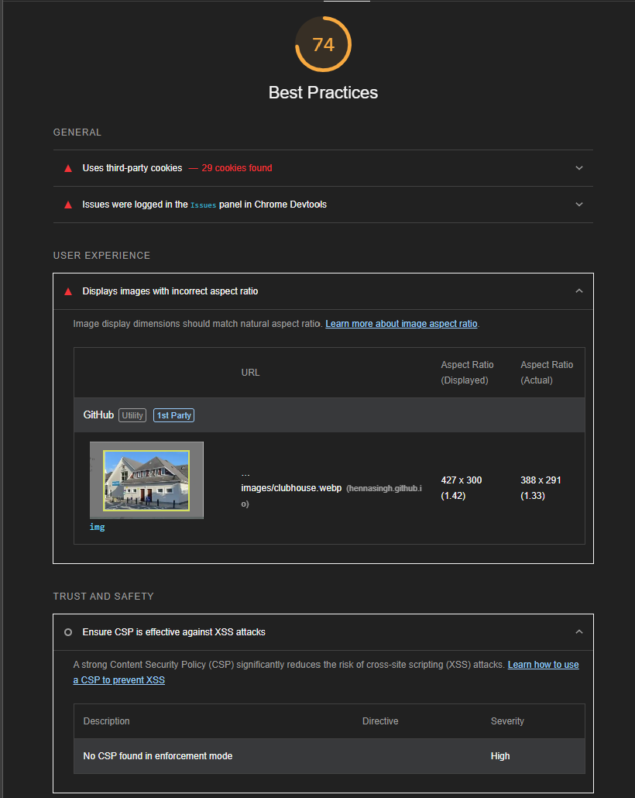
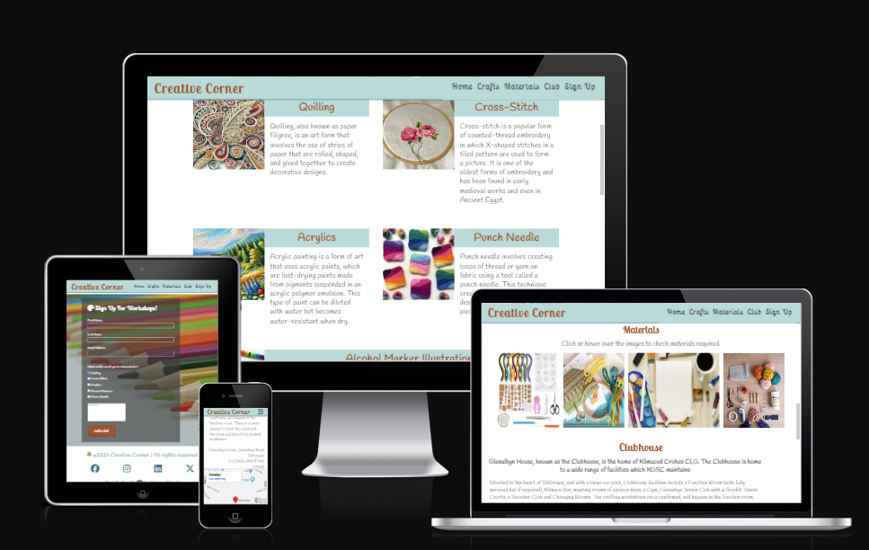

# Creative Corner - Testing

This page contains all the testing details the website was run through to produce perforamce insights.

## Automated Testing and Debugging

### W3C Validator

HTML and CSS code for the website were tested and validated by using [HTML Validator](https://validator.w3.org/#validate_by_input) and [CSS Validator](https://jigsaw.w3.org/css-validator/).

1. The first test with HTML validator displayed errors as shown

    
HTML Validation with Errors

2. The errors were fixed and another test was done

    
HTML Validation - No Errors

1. First test with CSS Validator showed errors

    
CSS Validation with Errors

2. Another test on fixing the above errors

    
CSS Validation - No Errors

### Lighthouse

This is an open-source, automated tool for improving the quality of web pages. It has audits for performance, accessibility, progressive
web apps, SEO, and more.

#### Mobile

1. This was the initial report on the first test with lighthouse.

    
Lighthouse - Initial Report

    
Lighthouse - Second Report on Fixing

#### Desktop

    
Lighthouse - Initial Report

There were issues in image sizes and aspect ratios that affected the performance score in both Desktop and Mobile. I would get back on this on how to improve image sizes. The first effort was to reduce image size for each image and convert all jpg or png to webp images. Further options need to be explored.

1. The performance on desktop was improved further. Image sizes were modified using image sizer tool and aspect ratio was maintained.

    
Lighthouse Report - Final

2. The low score for best practices in Desktop was because of cookies. I yet do not know how to improve them.

    
Lighthouse Report - Best Practices

## Manual Testing

### Testing User Stories

#### First Time Visitor Goals

>  I should be able to understand the purpose of the website and to learn more about the business.

> The content can be easily navigated without back and forth

    
The home section introduces the website. The site also has a clear navbar to navigate through the page

#### Returning Visitor Goals

> I want to know how to contact the business for more information to participate

> I want to look at new activities and events happening and able to register for it.

    
The website explains different crafts and materials required for each class and provides a signup form for user to register

Future Implementation of the website will provide user testimonials and workshop timings.

### Testing Devices

Testing was performed on :
- Laptop
  - Lenovo Yoga 9

- Desktop Screen
  - 29 inch View Sonic Screen

- Browsers
  - Google Chrome

### Manual Feature Tests

| Action | Expected Outcome | Result |
|--------| -----------------|--------|
| Click all links on navbar | Redirect to the respected section | Pass |
| Click on the logo | Redirect to home section | Pass |
| Check all images | Images are properly displayed | Pass |
| Click on image in material section | Displays the materials for the particular image | Pass |
| Hover over the images for material section | Displayes the materials for that image | Pass |
| Hover over the list items in navbar | Underline the particular list item | Pass |
| Click on larger map in the iframe | opens map in the new tab | Pass |
| Enter details in the form | Displays successful form submission | Pass |
| Enter incorrect email or without '@' symbol | Gives error to enter correct email | Pass |
| Leave input text empty | Displays required error | Pass |
| Leave empty checkboxes or textarea | Throws an error | Fail |
| Click social media links | Opens in a new tab | Pass |

## Struggles and New Learnings

I had some struggles when I started working on the project and learnt a few things while I fixed them.
1. The first issue I had was displaying my footer on the mobile view. I had added 3 paragraphs in my footer and wanted to display in column for mobile and in row for desktop. I had enclosed 3 sections in div and had given flex display to `footer` with column direction. This made it impossible to give `space-evenly` to `justify-content` attribute to the ul element as giving `flex` display to footer made it confined to the text size. Two ways to fix this were, giving either `width` to the `ul` element or removing `flex` display from the footer as other elements will be block display and giving `flex` only to unordered list.

2. The second issue I faced was displaying images in the home screen for mobile screens. I aimed to create sliding images by using only HTML and CSS. This was a bit of a struggle as I was unable to fit my images in the mobile screen as I pictured in my wireframe. I struggled further with relative position for images as it broke my header and footer design. I saved the commit which I may come back to again. I decided to create a gif image of the gallery images and add them to the home screen.

3. Another struggle I faced was when I started the crafts section. I had a different wireframe but I was not able to fit the content in the mobile view, the same way I had created my wireframe. I modified the UI to fit the mobile view.

4. I also struggled with displaying the crafts section for the tablet and larger screens. The text associated with the craft appeared longer than the image. I am still figuring out on how to make a proper display for it. I believe I would either shorten the text, or make the display vertical rather than the horizontal change on larger screens.

5. I struggled with managing the width of the components on the website. The images would get distorted on 4k and higher resolution screens. I am still figuring out to fix it. Mentor suggested to give max-width to all the content in the main section. I am trying to see if I can give max-width to certain sections than the entire page.

6. I struggled in maintaining the aspect ratio of images and prevent from distorting. I ended up changing all those images and used chatGPT to generate images for some art forms (quilling, acrylics and alcohol sketches)

