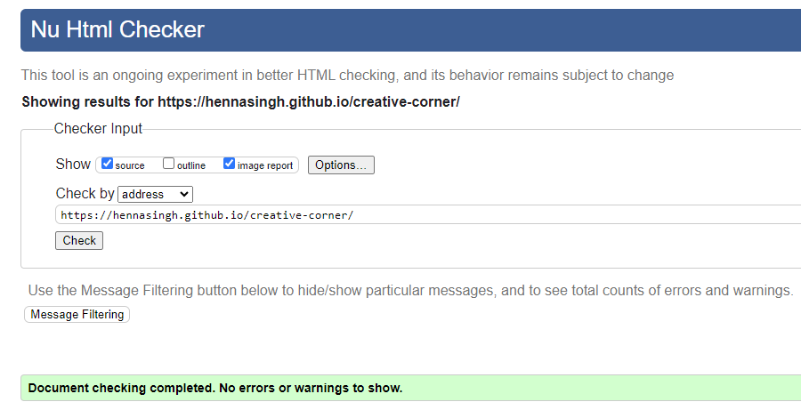
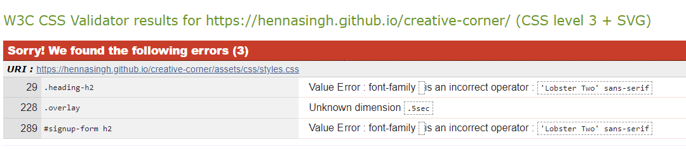

# Creative Corner - Testing

This page contains all the testing details the website was run through to produce perforamce insights.

## Automated Testing and Debugging

### W3C Validator

HTML and CSS code for the website were tested and validated by using [HTML Validator](https://validator.w3.org/#validate_by_input) and [CSS Validator](https://jigsaw.w3.org/css-validator/).

1. The first test with HTML validator displayed errors as shown

    
HTML Validation with Errors

[W3C HTML Validation- With Errors](./assets/images/htmlValidationWithErrors.png)

2. The errors were fixed and another test was done

    
HTML Validation - No Errors

1. First test with CSS Validator showed errors

    
CSS Validation with Errors

2. Another test on fixing the above errors

    
CSS Validation - No Errors

### Lighthouse

This is an open-source, automated tool for improving the quality of web pages. It has audits for performance, accessibility, progressive
web apps, SEO, and more.

#### Mobile

1. This was the initial report on the first test with lighthouse.

    
Lighthouse - Initial Report

    
Lighthouse - Second Report on Fixing

#### Desktop

    
Lighthouse - Initial Report

There were issues in image sizes and aspect ratios that affected the performance score in both Desktop and Mobile. I would get back on this on how to improve image sizes. The first effort was to reduce image size for each image and convert all jpg or png to webp images. Further options need to be explored.

The low score for best practices in Desktop was because of cookies. I yet do not know how to improve them.

1. The performance on desktop was improved further. Image sizes were modified using image sizer tool and aspect ratio was maintained. To improve the score for best practices, image sizes were kept consistent on larger screens.

